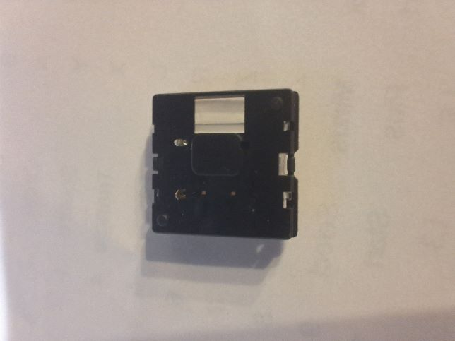

# kailh-x-switch
KiCad footprint for the Kailh X Switch, which I have sometimes seen called the Ultra Low Profile or ULP.

This footprint is based from the schematic and measurements taken from the keyswitch. Note that the footprint given on the schematic is from the rear of the switch.

Footprint:

Physical part:

Schematic:

